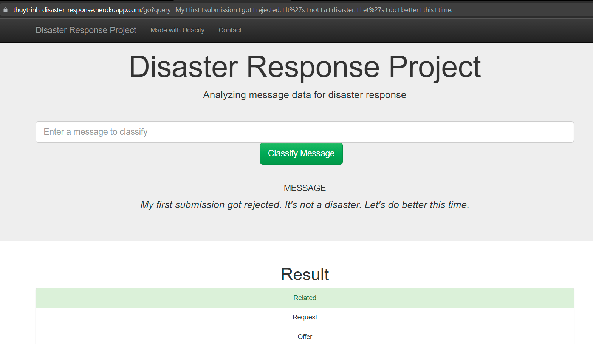

# Disaster Responses Pipeline
## Project Overview
In this project, we'll apply data engineering skills to analyze disaster data from [Figure Eight](https://www.figure-eight.com/) t
o build a model for an API that classifies disaster messages.

**Data**: two datasets downloaded from Figure Eight:
1. `data/DisasterMessages.csv`: real messages that were sent during disaster events 
2. `data/DisasterCategories.csv`: lables of which categories each of the message belong to.

**Output**: 
1. a machine learning pipeline to categorize these events so that we can send the messages to 
an appropriate disaster relief agency.

2. a web app where an emergency worker can input a new message and get classification results 
in several categories. The web app will also display visualizations of the data.

Below are a few screenshots of the web app.

## Installation
This project requires Python 3.x and others libraries included in the `requirements.txt` file.

## Instructions
To run the pipeline locally, in a terminal that contains this README file, 
run commands in the following sequence:
 + Install neccessary packages:

    pip install -r requirements.txt
 + Extract, Tranform, Load raw data:
 

    python data/process_data.py data/DisasterMessages.csv data/DisasterCategories.csv data/DisasterResponse.db

 + Build ML pipeline: Build, Train, Test, Tune and Save models:
 

    python models/train_classifier.py data/DisasterResponse.db models/classifier.pkl

 + Launch webapp:

    python app/run.py

 Local host [http://localhost:3001](http://localhost:3001) should be opened up in your browser.
 
 In the web app, you can input any text message (in English) and it will categorize it among 35 categories, 
 as displayed in this [notebook](https://github.com/thuytrinht4/disaster-response-pipeline/blob/master/ETL_Pipeline_Preparation.ipynb).

# Project Components
There are three components of this project.

### 1. ETL Pipeline
A Python script, `process_data.py`, contains data cleaning pipeline that:
+ Loads the `messages` and `categories` datasets
+ Tranform the two sets:
  + Merges the two datasets
  + Cleans the data
+ Stores the clean dataset a SQLite database

### 2. ML Pipeline
A Python script, `train_classifier.py`, contains machine learning pipeline that:
+ Loads data from the SQLite database
+ Splits the dataset into training and test sets
+ Builds a text processing and machine learning pipeline
+ Trains and tunes a model using GridSearchCV
+ Outputs results on the test set
+ Exports the final model as a pickle file

### 3. Flask Web App
A Python script, `run.py` file is written for flask web app deployment

+ Modify file paths for database and model as needed
+ Add data visualizations using Plotly in the web app.

# Project Structure
Here's the file structure of the project:

        - app
        | - template
        | |- master.html  # main page of web app
        | |- go.html  # classification result page of web app
        |- run.py  # Flask file that runs app

        - data
        |- DisasterCategories.csv  # data to process 
        |- DisasterMessages.csv  # data to process
        |- process_data.py       # etl pipeline
        |- DisasterResponse.db   # database to save clean data to

        - models
        |- train_classifier.py   # ML pipeline
        |- custom_transformer.py     # custom transformer for Scikit-pipeline 
        |- classifier.pkl  # saved model 

        - ETL_Pipeline_Preparation.ipynb # notebook file of Project Workspace - ETL
        - ML_Pipeline_Preparation.ipynb # notebook file of Project Workspace - Machine Learning Pipeline.
        - README.md